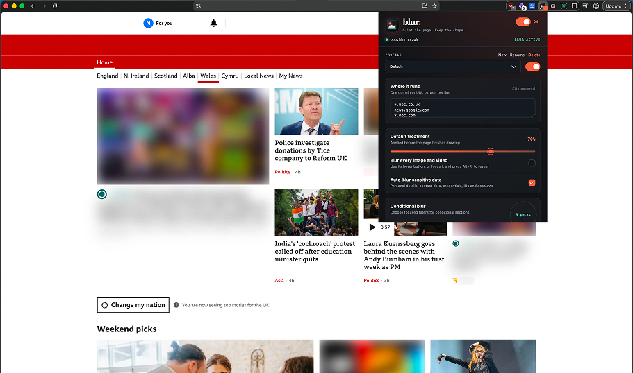

# Blur

Blur distracting or sensitive page content before it reaches your screen share, recording or line of sight.


## What it does

- Blur every image and video on selected websites.
- Detect and blur common sensitive data in page text and form fields.
- Keep separate profiles for different sites or tasks.
- Remember individual elements or repeated page sections.
- Blur saved sections only when spoiler, violence, result or custom terms match.
- Temporarily reveal blurred content from its hover controls.
- Pause one profile or the whole extension.



## How to use it

1. Install Blur and open a normal website.
2. Open the extension popup.
3. Select **Use this site** to add the current domain to the default profile.
4. Adjust the blur strength and choose whether to blur media and sensitive data.
5. Select **Pick element** or **Pick section**, then choose content on the page.
6. Press `↑` or `↓` while picking a section to change its scope, or use **Draw area** for content that is difficult to select.
7. To make a saved section conditional, enable a filter pack or add trigger terms, then choose **Blur on trigger words** for that selection.

Profiles accept one site pattern per line. Examples include `example.com`, `*.example.com`, `example.com/account/*`, a complete URL pattern, or `*` for every HTTP and HTTPS site. Settings save automatically.

Select **Backup** to download the current profiles as `blur-settings.json`. Importing a backup replaces the current settings.

## Install from source

1. Open `chrome://extensions`.
2. Enable **Developer mode**.
3. Select **Load unpacked** and choose this repository.
4. Reload an already-open website after the first installation.

## Privacy

Blur stores profiles, site patterns, blur settings, trigger terms, selector labels and selectors in Chrome's local extension storage. Backups contain the same settings. It does not store the page text, field values or media it checks.

Detection runs inside the current tab. No page content or settings are transmitted, and the extension has no accounts, analytics, advertising, remote scripts or external API calls. Access to all sites lets Blur apply configured profiles early enough to reduce visible flashes; unmatched sites receive no blur treatment.

Chrome prevents extensions from changing protected pages such as `chrome://` URLs and the Chrome Web Store.

## Limitations

- Websites that replace IDs or class names between visits may require a selection to be recreated.
- Cross-origin iframe contents are not blurred.
- Sensitive-data and conditional matching can miss unusual formats or produce false positives.
- Chrome storage and page execution are asynchronous, so a brief flash of unblurred content remains possible.

## Development

Blur is a dependency-free Manifest V3 extension with no build step.

```sh
pnpm check
pnpm test
pnpm --dir website install
pnpm --dir website check
```
